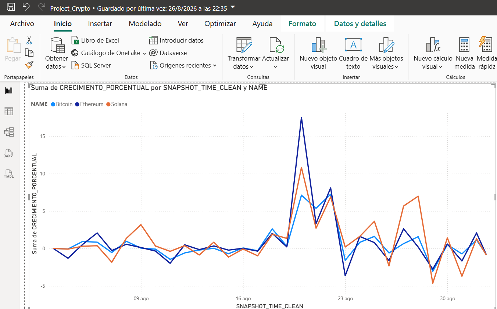

# crypto-elt-cloud-pipeline
End-to-end cloud data pipeline (ELT) built with Python, Snowflake, and Power BI to automate crypto historical data ingestion, analytical storage, and trend forecasting.

# Cloud Data Pipeline & Analytical Automation: Snowflake & Power BI

## Descripción del Proyecto
Este proyecto implementa una arquitectura moderna de datos bajo el paradigma **ELT** (Extract, Load, Transform). Automatiza la ingesta masiva del historial financiero de las principales criptomonedas (Bitcoin, Ethereum, Solana) desde la API de CoinGecko hacia un Data Warehouse en la nube utilizando Python, delega la lógica de cálculo analítico pesado al motor de Snowflake mediante procedimientos almacenados, y consolida un modelo dimensional en Power BI.

## Tecnologías y Herramientas Utilizadas
* **Lenguaje:** Python 3 (Google Colab / Jupyter)
* **Librerías de Ingesta:** Snowflake Connector Python, Pandas, Requests
* **Data Warehouse Cloud:** Snowflake (Esquema RAW, Motores virtuales XSMALL)
* **Lógica de Base de Datos:** Advanced SQL (Stored Procedures, Tasks, Analytical Window Functions)
* **Visualización & BI:** Power BI Desktop (Modelo en Estrella / Conectividad Cloud Import)

## Arquitectura del Pipeline e Infraestructura Cloud

1. **Ingesta Autónoma (E & L):** Desarrollo de scripts en Python que consumen el endpoint histórico de la API de CoinGecko, realizando una carga masiva directa (*Bulk Load*) hacia la tabla cruda `RAW.CRYPTO_PRICES` en **Snowflake** mediante el controlador optimizado `write_pandas`.
2. **Cómputo Eficiente en la Nube (T):** Implementación de una arquitectura donde el costo de procesamiento se desplaza por completo al Data Warehouse. Se diseñó un **Procedimiento Almacenado (`sp_transform_crypto_data`)** que calcula de forma física las métricas de variaciones relativas diarias utilizando funciones de ventana avanzadas (`LAG` y `OVER`), mitigando el uso de DAX en tiempo real.
3. **Automatización:** Programación de una **Snowflake Task** con configuración CRON para ejecutar la actualización lógica de datos de forma autónoma todos los días de manera programada.
4. **Modelado Multidimensional (BI):** Conexión nativa desde Power BI a la capa analítica de Snowflake. Estructuración de un **Modelo en Estrella (Star Schema)** conectando tablas de Hechos (`FACT_CRYPTO_TRENDS`) con dimensiones maestras de activos (`dim_crypto`) y un calendario corporativo (`DIM_DATE`).

## Dashboard de Tendencias y Volatilidad (Vista Previa)
A continuación se detalla el comportamiento visual interactivo del entregable final de Business Intelligence, mostrando el crecimiento porcentual continuo a lo largo de las series temporales:

*El reporte permite evaluar la volatilidad cruzada partiendo desde el eje de equilibrio cero, optimizando el rendimiento de renderizado gracias al pre-cálculo en el backend cloud.*

